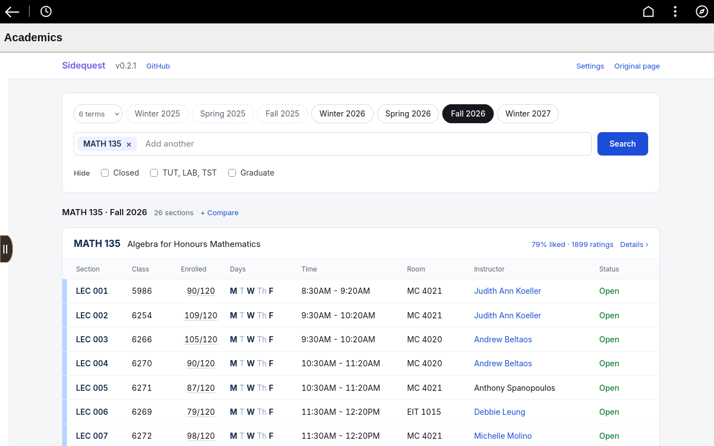

# UW Sidequest

> Note: This extension is not affiliated with the University of Waterloo

A browser extension for Chrome and Firefox that replaces Quest's class search with one containing various improvements; a UI refresh, autocomplete, displaying UWFlow information, multiple courses, and instructor teaching history.

It also adds Instructor, Room and Status information to the Course Schedule table on [uwflow.com](https://uwflow.com).

This extension uses your own signed-in UW Quest session, you must be able to access sensitive class information to see it within Quest.

More screenshots

## Installation

### Chrome

1. Open [UW Sidequest on the Chrome Web Store](https://chromewebstore.google.com/detail/uw-sidequest/meldhnjgpiingaeogojgpbmldagpmggl).
2. Click **Add to Chrome** and confirm the permissions.

To install it manually instead:

1. Download the ZIP from the [latest release](https://github.com/hhhapz/sidequest/releases/latest).
2. Unzip it.
3. Open `chrome://extensions`.
4. Turn on Developer mode.
5. Click **Load unpacked** and select the folder containing `manifest.json`.

### Firefox 140 or newer

1. Open [UW Sidequest on Firefox Add-ons](https://addons.mozilla.org/en-US/firefox/addon/uw-sidequest/).
2. Click **Add to Firefox** and confirm the permissions.

## Why?

A few years back, the UW public class API removed instructor and room information from the public. This brings back that information without making it accessible to anyone who doesn't already have that information.
