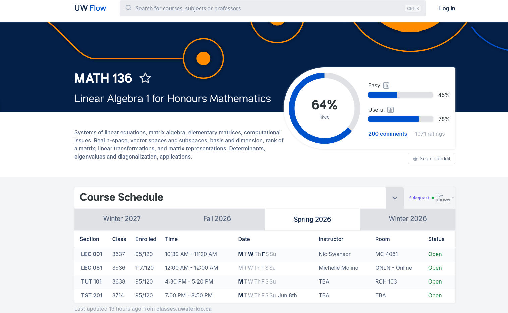

# UW Sidequest

A Browser extension Chrome and Firefox that adds Instructor, Room and Status information to the Course Schedule table on [uwflow.com](https://uwflow.com).

This extension uses your own signed-in UW Quest session, you must be able to access sensitive class information to see it within Quest.

## Why?

A few years back, the UW public class API removed instructor and room information from the public. This brings back that information without making it accessible to anyone who doesn't already have that information.
